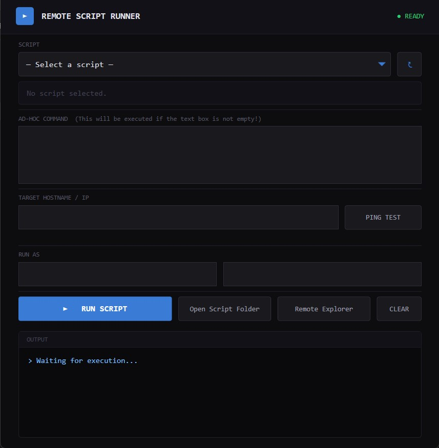

# Remote Script Runner

A tool for executing ad-hoc commands and custom PowerShell scripts on remote Windows computers with minimal permanent configuration changes.

# Overview

Remote Script Runner uses WMI to temporarily enable WinRM on a target computer, execute remote commands or PowerShell scripts, and then restore the original WinRM state once execution is complete.

This approach allows administrators to perform remote management tasks without requiring WinRM to remain permanently enabled on managed systems.

# Features

- Execute ad-hoc PowerShell commands on remote computers
- Run custom PowerShell scripts remotely
- You can put your scripts into the Scripts folder and execute them with the tool
- Remote Explorer: if the C drive is shared on the remote machine then the tool can connect to it
- Uses WMI for initial connectivity
- Starts WinRM only when required
- Restores the original WinRM service state after execution
- Reduces the attack surface compared to permanently enabled WinRM
- Suitable for administrative and automation tasks
- The tool can be started without Powershell console window by the runner.vbs

# How it works

1. Connects to the target computer using WMI.
2. Detects the current state of the WinRM service.
3. Starts WinRM if it is not already running.
4. Executes the requested command or PowerShell script remotely.
5. Collects execution results.
6. Restores the WinRM service to its original state.

# Requirments

- Windows PowerShell 5.1 or later
- Network connectivity to the target computer
- Appropriate administrative permissions
- WMI access enabled
- Remote administration permissions
- Firewall rules allowing WMI communication
- Security Considerations

Users should ensure that appropriate administrative permissions and network security controls are in place before using the tool.

# Use Cases

- Remote administration
- Incident response
- Software deployment
- Configuration management
- Troubleshooting and diagnostics
- Ad-hoc automation tasks

# License

This project is licensed under the MIT License.
